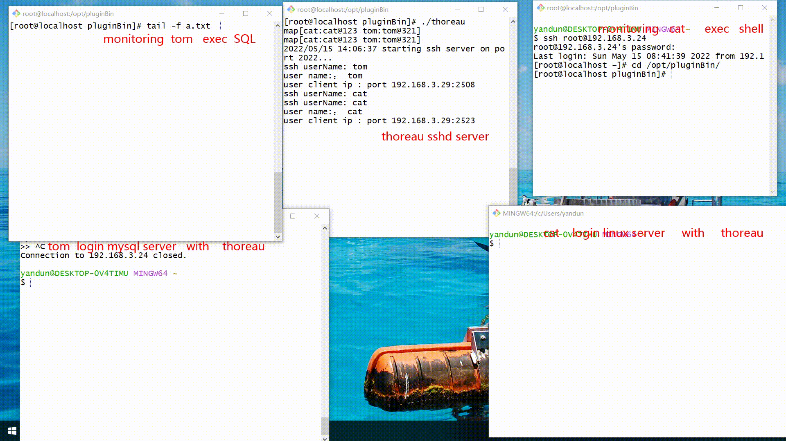
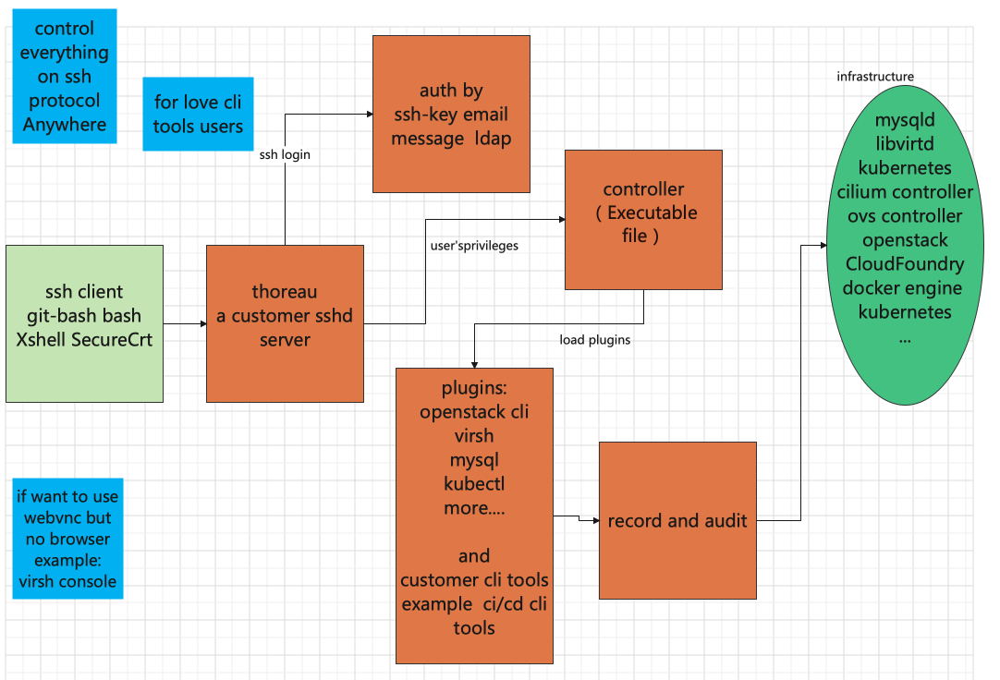

# demo gif





----





# hello thoreau


# sshserver


从私有仓库https://github.com/yimtun/sshServer 整理来  核心功能还未完成迁移 不是sshServer的全部功能


# buid env

```
go  version
go version go1.17.10 linux/amd64
```


# build

```
git clone https://github.com/yimtun/thoreau
cd thoreau
mkdir ./pluginBin
go build -o pluginBin/    thoreau.go
go build -o pluginBin/    controller/controller.go 
```


```
ls pluginBin/
controller	thoreau
```


install plugin


```
cd thoreau
git clone https://github.com/yimtun/cf
cd cf
go build cf.go
cp cf ../pluginBin
```

